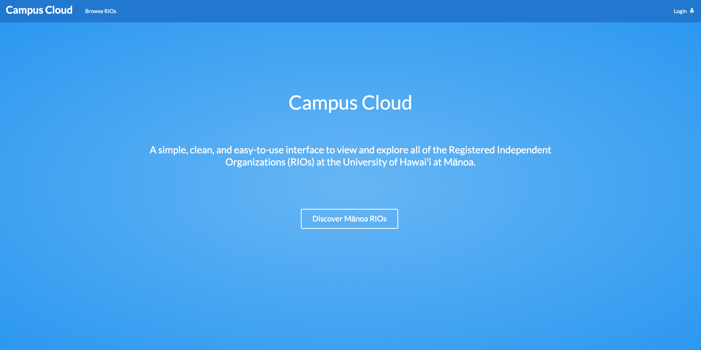
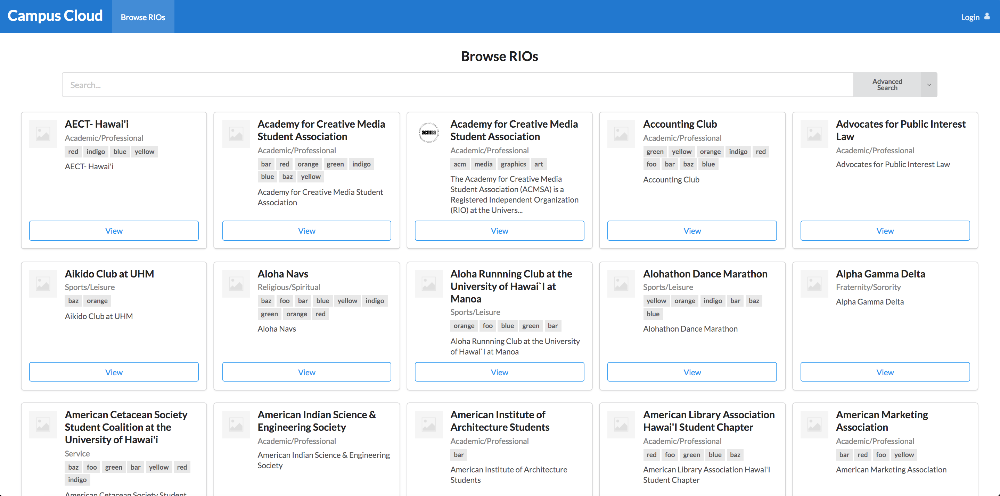

  
  

Campus cloud is an application built around the idea of a “club hub.” Our goal was to make it easier to search through the registered independent organizations or RIOs for short. We designed a club list page that would display all of the RIOs at UH Manoa and we implemented a search feature to be able to sort through the large list. The RIOs could also be updated with tags that match the description of their club/organization which can then be searched for using the filtering function. When you wanted to create a new organization/club, only the admins would be able to create it upon approval. The admins can also deactivate old clubs so that they no longer appear on the list and activate clubs that have started up again. Admin can also assign ownership of a club to someone who would be able to edit only the club they are assigned to.

For this project, I worked with Zac Hayashida and Ethan Chow who are friends of mine. For this project, we used the react and meteor frameworks and the semantic UI library. I worked on the create club feature for admins and the edit club feature for the club owners. I also worked on updating the GitHub page. From this experience, I learned a lot about teamwork and time management. Group work can be difficult because it requires the presence of all members sometimes which isn’t always easy to achieve. However, there is also a lot of ideas that get mixed together to create an amazing collaborative product. Time management also played a key factor in handling issues over time to get everything done before a certain deadline. If you would like to view our project, just click [here](https://campus-cloud.github.io).

