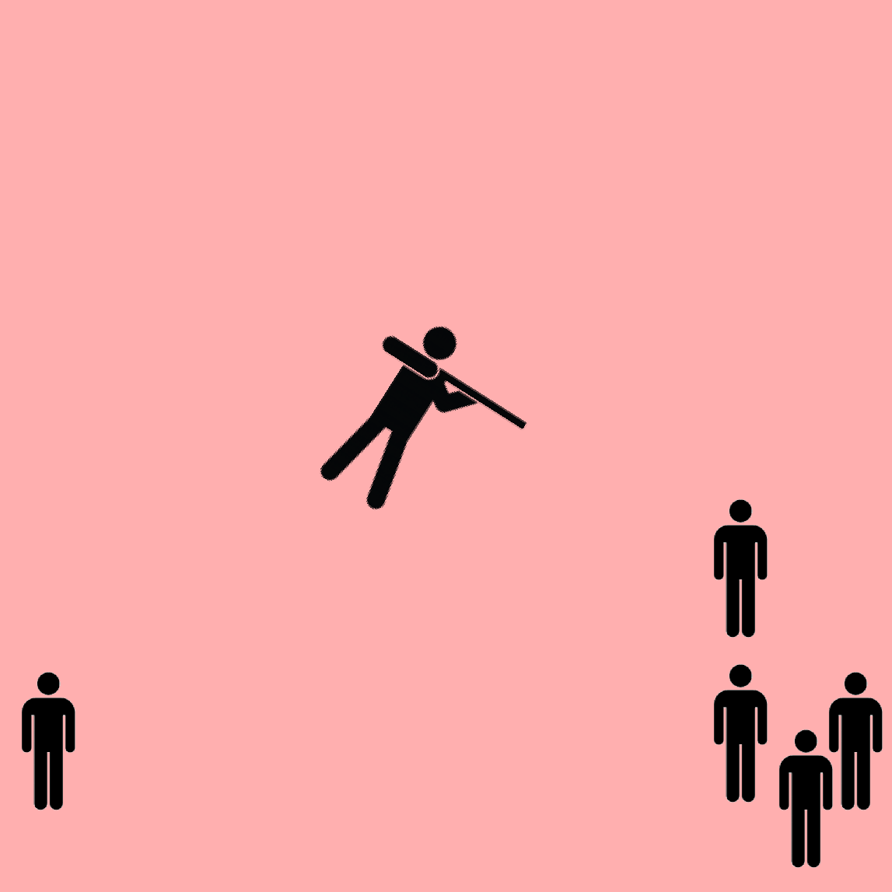
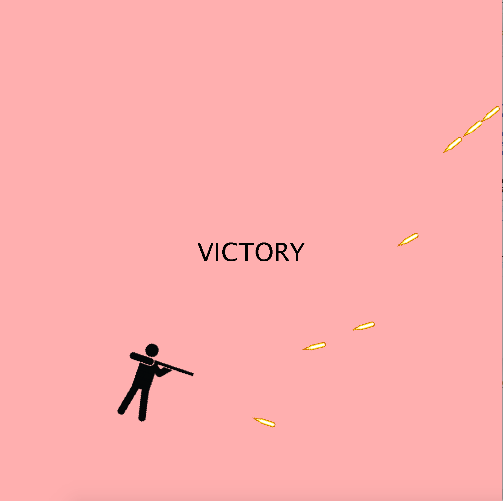

  
  

This project was originally supposed to be a final group project of sorts for ICS 111 where we could make whatever we wanted as long as it implemented the required tools. However, my group members for this project proved to be untrustworthy so I made the decision to work alone on this project. From that I learned not to group up with people that don't show up to class and to be sure to actually meet up and discuss progress and ideas. I also learned that having others to look over your code helps significantly especially when I was stuck for hours on end staring at my code trying to figure out what was wrong. My TA and Professor offered a lot of assistance whenever I got stuck or couldn't figure out how to tackle a problem. With that being said, I had planned to make a game of some sort from the beginning and I settled upon a top down, survival shooter. At the start of the project, I was overwhelmed by what I needed to do and from all of the methods and functions I needed to make to get this game going. But, after hours of struggling and figuring out where to start, I learned to take everything piece by piece, just like putting together a puzzle. One by one I finished up my classes and functions until I came to a project that I thought was at least presentable and worked to an extent that I didn't think would be possible. It wasn't my finest project but it was my first one that I've ever made and one I'm glad to have finished.

