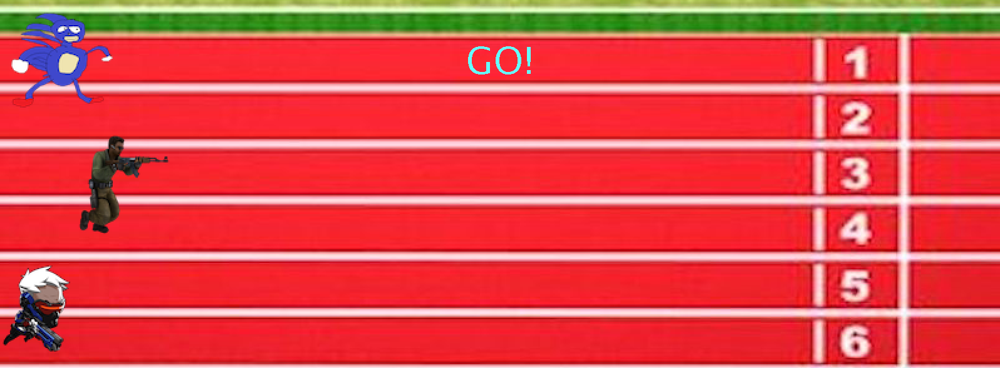

This was a simple project that we were assigned in ICS 111 where we had to make three runners on a track. Two of the runners moved by a random amount until the finish line and the last racer was controller by the player using 'a' and 's' to move. We were allowed to spruce up the project in any way that we wanted and I decided to add iconic characters from popular games and memes if you will. I was pretty proud of finishing this assignment because it was our first real assignment that we had to do by ourselves and we were allowed to express ourselves in our own way. Looking back on the project, the difficulty of the assignment didn't seem that hard but something about completing this task gave a sense of accomplishment that encouraged me along my ICS career. It introduced more problem solving skills and adding personal flair to my work that I enjoyed. 

You can see it run on [YouTube](https://www.youtube.com/watch?v=YwHJXKQF2E4).
