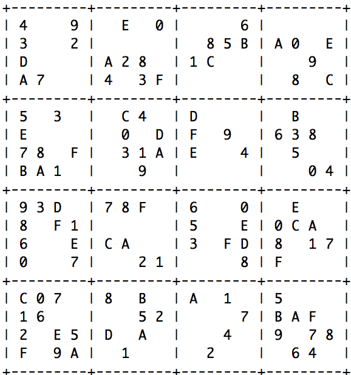
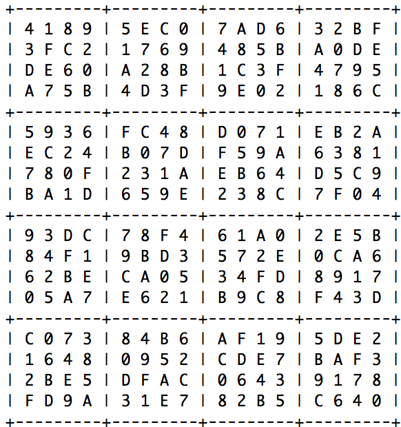

  
  

The sudoku solver was one of the toughest projects in ICS 211. It would take an unsolved sudoku puzzle and crunch in the numbers recursively until it brute forces the sudoku to completion. This project took a lot of time and effort to figure out how to tackle solving the problems recursively, checking for legal values, and checking to see if the created sudoku is a legal sudoku. Now if I ever have trouble with a 16x16 sudoku I can solve it exponentially quicker than I can by hand.

From this project I learned more about how recursion works and how useful it can be to brute force elaborate problems with a machine. It also helped to show me how programs that have to pick from a choice of options work when it comes to simple decision making. Programming a full A.I. for something like chess probably takes many more stategies and decision based programming than this solver but this project offered insight to how I may be able to develop bots for future games with simple decisions. 

